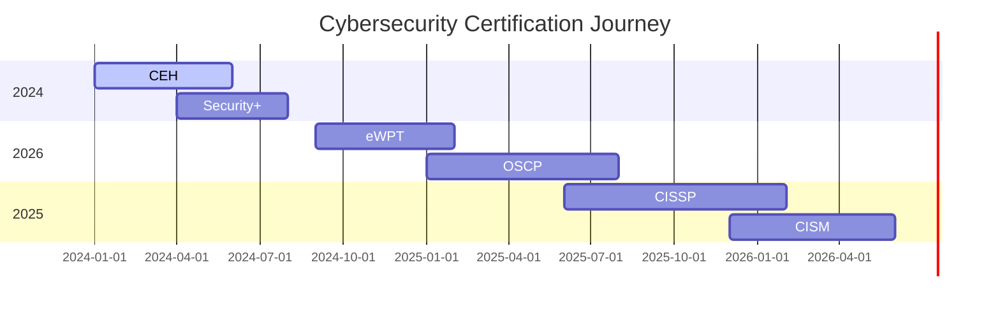

# 👨‍💻 Ahmad Fadhil | Cyber Security Enthusiast

```bash
┌──(root㉿kali)-[~/portfolio]
└─$ whoami && echo "Welcome to my digital realm"
ahmad_fadhil
Welcome to my digital realm

┌──(root㉿kali)-[~/portfolio] 
└─$ cat /etc/passwd | grep ahmad_fadhil
ahmad_fadhil:x:1000:1000:Full Stack Developer & Penetration Tester:/home/ahmad_fadhil:/bin/bash
```

<div align="center">

[](https://git.io/typing-svg)

</div>

---

## 🎯 **CURRENT STATUS**

```yaml
name: "Ahmad Fadhil"
location: "Bandung, West Java, Indonesia"
current_focus: 
  - "Advanced Web Penetration Testing"
  - "Red Team Operations"
  - "Secure Code Development"
learning:
  - "OWASP Testing Guide"
  - "Advanced Exploitation Techniques"
  - "Malware Analysis & Reverse Engineering"
certifications_in_progress:
  - "CEH (Certified Ethical Hacker)"
  - "eWPT (eLearnSecurity Web Penetration Tester)"
  - "OSCP (Offensive Security Certified Professional)"
```

---

## ⚡ **TECHNICAL ARSENAL**

### 🔴 **OFFENSIVE SECURITY TOOLKIT**

<details>
<summary>🎯 <b>RECONNAISSANCE & ENUMERATION</b></summary>

```bash
# Network Discovery & Port Scanning
nmap -sS -sV -O --script vuln target.com
masscan -p1-65535 --rate=10000 target.com
rustscan -a target.com -- -A -sC

# Web Application Discovery  
gobuster dir -u https://target.com -w /usr/share/wordlists/dirb/common.txt
ffuf -w /usr/share/wordlists/SecLists/Discovery/Web-Content/common.txt -u https://target.com/FUZZ
nikto -h https://target.com

# DNS Enumeration
dig axfr @ns1.target.com target.com
dnsrecon -d target.com -t axfr
amass enum -d target.com
```

**Tools:** `nmap` • `masscan` • `gobuster` • `ffuf` • `nikto` • `amass` • `subfinder` • `httpx`

</details>

<details>
<summary>🕷️ <b>WEB APPLICATION TESTING</b></summary>

```bash
# SQL Injection Testing
sqlmap -u "https://target.com/page?id=1" --batch --dbs
sqlmap -u "https://target.com/page?id=1" --dump-all

# XSS Testing
echo "https://target.com" | waybackurls | gf xss | qsreplace '"><script>alert(1)</script>' | freq

# Directory Traversal
curl -s "https://target.com/page?file=../../../etc/passwd"

# Parameter Discovery
paramspider -d target.com
arjun -u https://target.com/page
```

**Tools:** `Burp Suite Professional` • `OWASP ZAP` • `sqlmap` • `xsstrike` • `commix` • `wfuzz`

</details>

<details>
<summary>💀 <b>EXPLOITATION & POST-EXPLOITATION</b></summary>

```bash
# Metasploit Framework
msfconsole
use exploit/multi/handler
set payload windows/x64/meterpreter/reverse_tcp
exploit -j

# Privilege Escalation
./linpeas.sh
./winpeas.exe
python3 -m http.server 8000

# Persistence & Lateral Movement
crackmapexec smb 192.168.1.0/24 -u admin -p password
impacket-secretsdump domain/user:password@target
```

**Tools:** `Metasploit` • `Cobalt Strike` • `Empire` • `BloodHound` • `mimikatz` • `impacket`

</details>

### 🟢 **DEVELOPMENT STACK**

<div align="center">

| **Frontend** | **Backend** | **Security** | **DevOps** |
|:---:|:---:|:---:|:---:|
|  |  |  |  |
|  |  |  |  |
|  |  |  |  |
|  |  |  |  |

</div>

---

## 📊 **PENETRATION TESTING PROGRESS**

<div align="center">

### 🎯 **SKILL MATRIX**

| **Domain** | **Level** | **Tools Mastered** | **Next Target** |
|:---|:---:|:---|:---|
| **Web App Security** |  | Burp Suite, OWASP ZAP, SQLmap | Advanced WAF Bypass |
| **Network Penetration** |  | Nmap, Metasploit, Nessus | Active Directory Attacks |
| **Social Engineering** |  | SET, GoPhish, King Phisher | Physical Security |
| **Malware Analysis** |  | Ghidra, x64dbg, Wireshark | Dynamic Analysis |
| **Digital Forensics** |  | Autopsy, Volatility, FTK | Mobile Forensics |

### 🏆 **CERTIFICATION ROADMAP**



</div>

---

## 🎮 **TRAINING GROUNDS & ACHIEVEMENTS**

<div align="center">

### 🏴‍☠️ **CTF PLATFORMS**

[](https://tryhackme.com/p/dhiljaa)
[](https://app.hackthebox.com/profile/dhiljaa)
[](#)
[](#)

### 📈 **CURRENT RANKINGS**

| Platform | Rank | Points | Streak |
|:---:|:---:|:---:|:---:|
| **TryHackMe** | 🥇 Top 10% | 2,500+ | 30 days |
| **Hack The Box** | 🥈 Hacker | 1,200+ | Active |
| **VulnHub** | 🥉 Intermediate | 50+ VMs | Weekly |

</div>

---

## 🔥 **RECENT PROJECTS & EXPLOITS**

### 🎯 **WEB APPLICATION SECURITY**

<table>
<tr>
<td width="50%">

#### 🕷️ **Vulnerable Web App Scanner**
```bash
#!/bin/bash
# Custom vulnerability scanner
target=$1
echo "[+] Starting scan on $target"
nmap -sV --script vuln $target
gobuster dir -u $target -w /usr/share/wordlists/dirb/common.txt
```
**Stack:** `Python` • `Bash` • `Nmap` • `Custom Scripts`
**Features:** Automated scanning, Custom payloads, Report generation

</td>
<td width="50%">

#### 🔍 **OSINT Automation Tool** 
```python
import requests
import json
from shodan import Shodan

class OSINTFramework:
    def __init__(self, target):
        self.target = target
    
    def scan_subdomains(self):
        # Subdomain enumeration logic
        pass
```
**Stack:** `Python` • `APIs` • `Web Scraping`
**Features:** Domain intel, Social media analysis, Dark web monitoring

</td>
</tr>
</table>

### 🏢 **PROFESSIONAL DEVELOPMENT PROJECTS**

<div align="center">

| **Project** | **Type** | **Security Focus** | **Status** |
|:---|:---:|:---|:---:|
| **🎬 EH Film** | Media Platform | XSS Prevention, Input Validation | [Live](https://ehfilm.vercel.app/) |
| **📖 Al-Quran Digital** | Religious App | Secure API Integration, Data Protection | [Live](https://al-ikhsan-digital-quran.vercel.app/) |
| **☁️ Negantara Cloud** | Cloud Services | Infrastructure Security, Access Control | [Live](https://negantara-cloud.vercel.app/) |
| **🏠 EHF Residence** | Real Estate | SQL Injection Prevention, Session Security | [Live](https://ehf-residence.vercel.app/) |

</div>

---

## 📊 **GITHUB INTELLIGENCE**

<div align="center">

### 🔥 **DEVELOPMENT METRICS**


### 🎯 **CODE ANALYSIS**


### 🏆 **ACHIEVEMENTS UNLOCKED**


</div>

---

## 🌐 **SECURE COMMUNICATION CHANNELS**

<div align="center">

### 📡 **PROFESSIONAL NETWORKS**

[](https://www.linkedin.com/in/ahmad-fadhil-3594672a4/)
[](https://ehfcreative.xyz/)
[](mailto:ahmadfadhil289@gmail.com)

### 🎨 **CONTENT CHANNELS**

[](https://www.tiktok.com/@ehfcreative)
[](https://youtube.com/@ehfcreative)
[](https://dev.to/dhiljaa)

### 🔒 **SECURE CHANNELS**

[](#)
[](#)
[](#)

</div>

---

## 🎭 **ETHICAL HACKER'S CREED**

<div align="center">

```ascii
╔══════════════════════════════════════════════════════════════════╗
║                                                                  ║
║  "I am a guardian of the digital realm. I use my skills to       ║
║   protect, not to harm. I seek knowledge to strengthen           ║
║   defenses, not to exploit vulnerabilities for personal gain.    ║
║   I am committed to ethical practices, responsible disclosure,    ║
║   and making the internet a safer place for everyone."           ║
║                                                                  ║
╚══════════════════════════════════════════════════════════════════╝
```

### 🎯 **MISSION STATEMENT**

> *Building secure applications by day, hunting vulnerabilities by night.*
> 
> *Always learning, always improving, always ethical.*

</div>

---

<div align="center">

```bash
┌──(root㉿kali)-[~/portfolio]
└─$ echo "Thanks for visiting my digital fortress!"
Thanks for visiting my digital fortress!

┌──(root㉿kali)-[~/portfolio]  
└─$ exit
logout
```


[](https://github.com/dhiljaa?tab=followers)

**⚡ Remember: With great power comes great responsibility ⚡**

</div>
